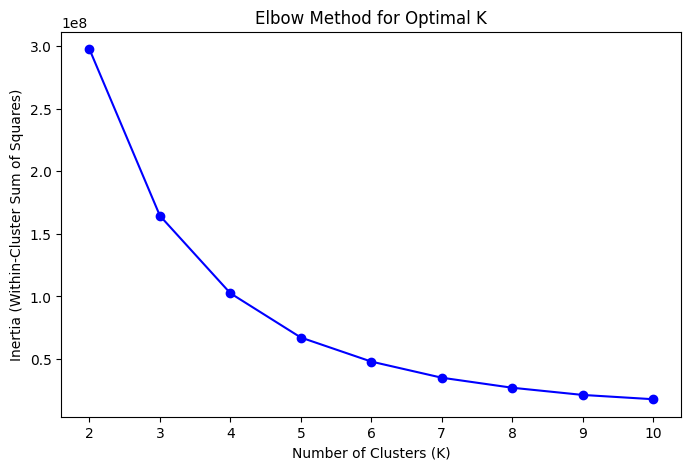
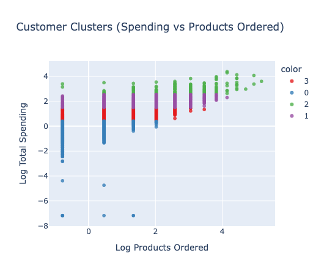
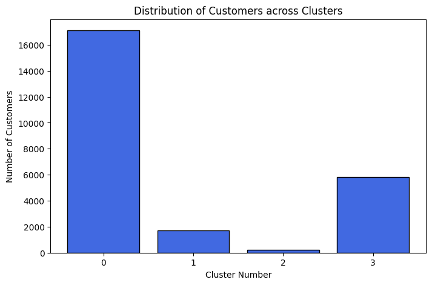

# Customer Segmentation using K-Means Clustering

## Project Overview

This project builds an end-to-end customer segmentation system using unsupervised machine learning. The goal is to group customers based on their purchasing behavior so that businesses can better understand customer patterns and design targeted marketing or retention strategies.

The workflow begins with raw transactional order data and transforms it into meaningful behavioral features. These features are then normalized and used to train a K-Means clustering model that identifies distinct customer segments.

The final output is a dataset assigning every customer to a behavioral segment along with interpretable cluster insights.

## Problem Statement

Businesses often possess large volumes of transactional order data but lack structured methods to understand customer purchasing behavior.

Without segmentation, it is difficult to :
- Identify high-value customers
- Detect low-engagement customers
- Understand purchasing intensity
- Tailor marketing campaigns effectively

This project addresses the problem by building a data-driven segmentation pipeline that groups customers based on spending patterns, purchasing activity and return behavior.

## Project Objectives

The primary objectives of this project are :
1. Transform raw order-level data into customer-level behavioral features
2. Apply unsupervised clustering to identify meaningful customer groups
3. Analyze cluster characteristics to generate interpretable business insights
4. Produce a dataset containing customer segment assignments for downstream analysis

## Dataset Description

### Data Source
Kaggle – E-commerce order transaction dataset.

### Data Characteristics
The raw dataset contains 70,052 order-level records with 17 features, including product information order identifiers, quantities and sales values.

### Key Features

| Column | Description |
|--------|-------------|
| product_title | Name of product |
| product_type | Product category |
| variant_sku | Product SKU |
| customer_id | Unique customer identifier |
| order_id | Unique order identifier |
| day | Order date |
| ordered_item_quantity | Quantity ordered |
| returned_item_quantity | Quantity returned |
| gross_sales | Total product price |
| discounts | Discount value |
| returns | Return value |
| net_sales | Sales after adjustments |
| taxes | Applied tax |
| total_sales | Final transaction value |

### Data Size and Timeframe
- 70,052 order-level records
- 17 raw features
- 24,874 unique customers after aggregation

## System Architecture / Pipeline

The segmentation system follows the pipeline below :

```
Raw Transaction Data
        │
        ▼
Data Cleaning & Filtering
(remove invalid order quantities)
        │
        ▼
Customer-Level Aggregation
(group by customer_id)
        │
        ▼
Feature Engineering
(products ordered, spending, return rate)
        │
        ▼
Feature Transformation
(log transformation + scaling)
        │
        ▼
Feature Standardization
(StandardScaler)
        │
        ▼
Optimal Cluster Selection
(Elbow Method)
        │
        ▼
K-Means Clustering
(K = 4 clusters)
        │
        ▼
Cluster Analysis
(cluster statistics + visualizations)
        │
        ▼
Customer Segment Dataset
(customer_segments.csv)
```

## Feature Engineering

The project converts raw order data into customer-level behavioral features.

### 1. Products Ordered
Measures how many distinct product types a customer has ordered.

**Why it matters :**
- Captures purchasing diversity
- Distinguishes occasional buyers from frequent purchasers

### 2. Average Return Rate
Calculated as :

```
Return Rate = Returned Quantity / Ordered Quantity
```

Computed per order and averaged per customer.

**Why it matters :**
- Identifies customers with high return behavior
- Useful for operational and logistics analysis

### 3. Total Spending
Total sales aggregated across all orders for each customer.

```
Total Spending = Σ Total_Sales
```

**Why it matters :**
- Identifies high-value customers
- Key driver of revenue segmentation

### Feature Transformation

Customer behavior variables were heavily skewed. To stabilize variance and improve clustering quality :

**Log Transformation**

Applied to all behavioral features :
- log_products_ordered
- log_average_return_rate
- log_total_spending

This reduces skew and compresses extreme values.

### Scaling

Features were standardized using :

```
StandardScaler
```

This ensures equal contribution of each feature during clustering.

## Modeling Approach

### Algorithms Used
**K-Means Clustering**

**Why K-Means?**
- Efficient for large datasets (24,874 customers)
- Works well with numeric behavioral features
- Produces interpretable cluster centroids

### Optimal Cluster Selection
The Elbow Method was used to determine the optimal number of clusters.

**K values tested :** 2 – 10

The elbow in the inertia curve indicated :

**Optimal K = 4**

### Model Training Strategy
- Features : log-transformed and standardized behavioral metrics
- Algorithm : K-Means with random_state=42 for reproducibility
- Max iterations : 300
- Initialization : k-means++

## Evaluation Strategy

Because clustering is unsupervised, evaluation focuses on cluster interpretability and separation.

**Metrics and Diagnostics used :**
- Elbow Method (inertia)
- Feature distribution inspection
- Cluster centroid analysis
- Cluster size distribution
- Scatter visualization of clusters

## Results Summary

The algorithm identified four distinct customer segments.

### Cluster Distribution

| Cluster | Customers |
|---------|-----------|
| Cluster 0 | 17,113 |
| Cluster 1 | 1,732 |
| Cluster 2 | 223 |
| Cluster 3 | 5,806 |

### Segment Interpretation

**Cluster 0 — Low Spenders, High Returns**

*Characteristics :*
- Low purchase activity
- Small transaction values
- Higher relative return behavior

*Implication :* Potential dissatisfaction or poor product fit

**Cluster 1 — High Value Customers**

*Characteristics :*
- High spending
- Frequent purchases
- Low return rate

*Implication :* Highest revenue contribution, ideal candidates for loyalty programs

**Cluster 2 — Heavy Buyers**

*Characteristics :*
- Extremely high spending
- Very frequent purchases

*Implication :* Strategic VIP segment

**Cluster 3 — Occasional Buyers**

*Characteristics :*
- Moderate spending
- Irregular purchasing behavior

*Implication :* Potential growth segment through promotions

## Project Structure

```
Customer-Segmentation-using-KMeans-Clustering
│
├── data
│   ├── Orders - Analysis Task.csv
│   └── customer_segments.csv
│
├── notebooks
│   └── Customer Segmentation using Kmeans Clustering.ipynb
│
├── images
│   ├── elbow_method.png
│   ├── customer_clusters.png
│   └── cluster_distribution.png
│
├── .venv
│
└── README.md
```

### Description

| Directory/File | Description |
|----------------|-------------|
| `data/` | Contains the raw dataset and final segmentation output |
| `notebooks/` | Contains the full machine learning workflow notebook |
| `images/` | Stores visualizations used in documentation |
| `.venv/` | Python virtual environment (not tracked in repo) |
| `README.md` | Project documentation |

## Tech Stack

### Programming Language
- Python 3.13

### Data Processing
- Pandas (2.2)
- NumPy (1.26)

### Visualization
- Matplotlib (3.8)
- Seaborn (0.13)
- Plotly (5.18)

### Machine Learning
- Scikit-Learn (1.4)
  - KMeans
  - StandardScaler
  - MinMaxScaler

## Installation & Setup

### Clone the repository
```bash
git clone https://github.com/Bhavik-Patwa/Customer-Segmentation-using-Kmeans-Clustering.git
```

### Navigate to the project directory
```bash
cd Customer-Segmentation-using-Kmeans-Clustering
```

### Create virtual environment
```bash
python -m venv .venv
```

### Activate environment

**Mac/Linux :**
```bash
source .venv/bin/activate
```

**Windows :**
```bash
.venv\Scripts\activate
```

### Install dependencies
```bash
pip install pandas numpy matplotlib seaborn plotly scikit-learn
```

## How to Run the Pipeline

### Launch Jupyter notebook
```bash
jupyter notebook
```

### Open the notebook
Navigate to :
```
notebooks/Customer Segmentation using Kmeans Clustering.ipynb
```

### Execute
Run all cells sequentially to reproduce the complete pipeline from raw data to customer segments.

## Example Output / Results

The pipeline generates the file :

```
data/customer_segments.csv
```

### Example structure :

| products_ordered | average_return_rate | total_spending | cluster | cluster_name |
|-----------------|---------------------|----------------|---------|--------------|
| 1 | 0.0 | 260 | 3 | Occasional Buyers |
| 2 | 0.0 | 103 | 0 | Low Spenders, High Returns |
| 15 | 0.05 | 8450 | 1 | High Value Customers |
| 42 | 0.02 | 25600 | 2 | Heavy Buyers |

### This dataset can be used for :
- Marketing campaign targeting
- Churn prevention analysis
- Customer lifetime value modeling
- Product recommendation strategies

## Visual Results

### Elbow Method for Optimal K


### Customer Clusters Visualization


### Cluster Size Distribution


## Future Improvements

Potential improvements to the segmentation system include :
- Silhouette score validation for quantitative cluster evaluation
- Testing alternative clustering algorithms :
  - DBSCAN for density-based segmentation
  - Gaussian Mixture Models for probabilistic assignments
  - Hierarchical clustering for interpretable dendrograms
- Introducing additional behavioral features :
  - Purchase frequency (orders per time period)
  - Recency (days since last purchase)
  - Customer lifetime value projections
- Deploying the segmentation pipeline as an automated analytics workflow
- Building an interactive dashboard for business stakeholders to explore segments
- Implementing A/B testing framework to validate segment-based marketing interventions
